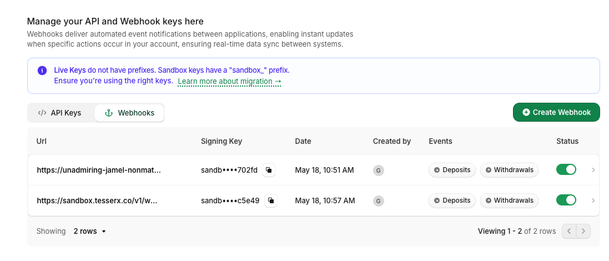
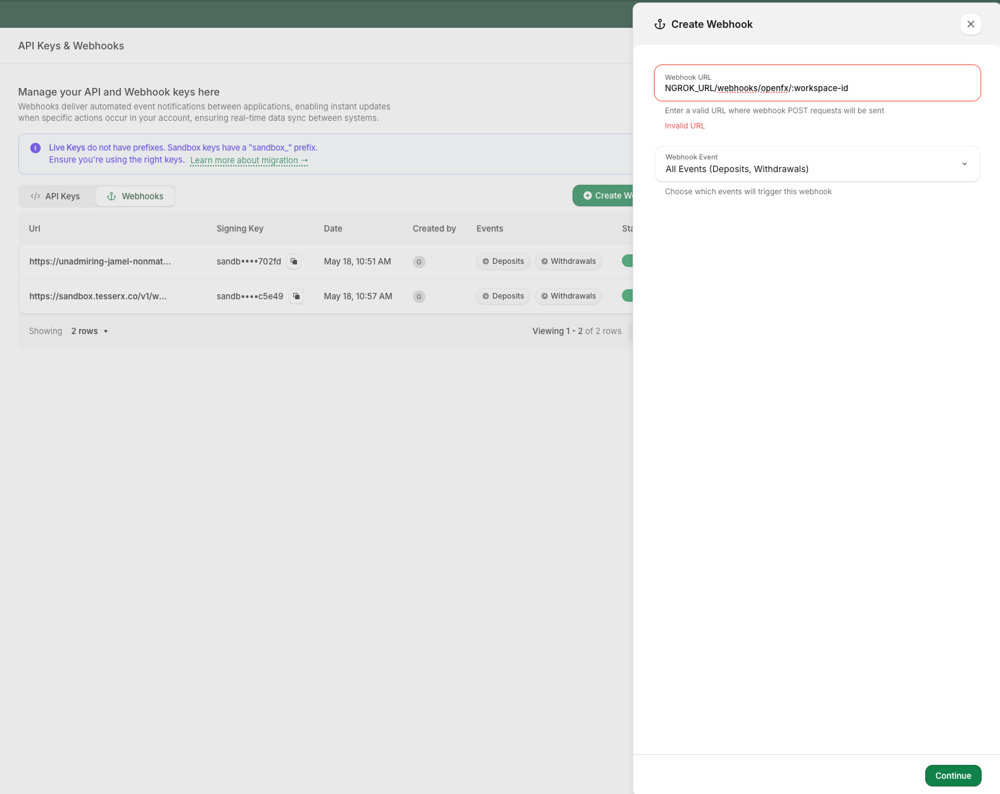

# Manual steps in the OpenFX dashboard

These steps happen in **OpenFX's own dashboard** (`https://app.openfx.com`), outside Tesser. The
developer does them once. The output is: the four credential values Tesser needs (step 1), a
registered webhook (step 2), and — for funds movement — the source bank (step 3) and destination
wallet(s) (step 4) registered with OpenFX.

> Source hierarchy: Tesser docs > Tesser platform code > OpenFX onboarding runbooks (the prod
> runbook + the `~/Documents/openfx 2` sandbox handoff) and OpenFX's own docs
> (`https://docs.openfx.com`). Confirm against the live OpenFX dashboard if the UI has changed.
>
> **Environment:** use the **sandbox** OpenFX dashboard for sandbox/staging, the **production** OpenFX
> dashboard for prod. Steps are the same except bank/wallet registration (steps 3–4), which production
> requires and reviews.

## What you need to produce

Four values end up in `.env.local`. Three are **auto-parsed from the downloaded key file** (Step 1);
the webhook secret is **entered by hand** (Step 2).

| `.env.local` var | Source | How |
|---|---|---|
| `OPENFX_ORG_ID` | key JSON field `orgId` | auto-parsed (Step 1) — OpenFX org UUID |
| `OPENFX_API_KEY` | key JSON field **`id`** | auto-parsed (Step 1) — sandbox value carries the `sandbox_` prefix; stored as-is |
| `OPENFX_PRIVATE_KEY` | key JSON field `privateKey` | auto-parsed (Step 1) — ES256 **PEM**, one `\n`-escaped line; normalized server-side |
| `OPENFX_WEBHOOK_SECRET` | the webhook **Signing Key** | **manual paste** (Step 2); register the webhook to get it |

## Step 1 — Download the API-key file, move it in, and parse it

OpenFX dashboard → **API Keys & Webhooks** → create an API key (sandbox key for sandbox/staging,
production key for prod). **Download the key's JSON** (named `OpenFX_api-key_*.json`), then **move it
into the working directory** where you're running the skill (next to `.env.local`). It's gitignored,
so it won't be committed — but it holds the ES256 private key, so keep it private and delete it when
done.

The skill then parses three of the four values out of it into `.env.local` (do not echo the private
key):

```bash
KEYFILE=$(ls OpenFX_api-key_*.json 2>/dev/null | head -1)
# UPSERT (replaces existing or empty-placeholder lines; safe to re-run)
touch .env.local
grep -vE '^OPENFX_(ORG_ID|API_KEY|PRIVATE_KEY)=' .env.local > .env.local.tmp
{
  printf 'OPENFX_ORG_ID=%s\n'      "$(jq -r .orgId "$KEYFILE")"     # → OPENFX_ORG_ID
  printf 'OPENFX_API_KEY=%s\n'     "$(jq -r .id "$KEYFILE")"        # → OPENFX_API_KEY (sandbox_-prefixed)
  printf 'OPENFX_PRIVATE_KEY=%s\n' "$(jq -c .privateKey "$KEYFILE")" # → OPENFX_PRIVATE_KEY (PEM, one \n-escaped line)
} >> .env.local.tmp
mv .env.local.tmp .env.local
```

The file also carries `name` (`org/{org-id}/apiKey/{api-key-id}`, OpenFX's JWT subject), `publicKey`,
`scope`, etc. — ignore them. The fourth value, `OPENFX_WEBHOOK_SECRET`, is **not** in the file; it
comes from Step 2.

> Auth model (context): OpenFX is called with a **self-signed ES256 JWT** (2-minute TTL, one per
> request), plus headers `x-api-key: <OPENFX_API_KEY>` and `x-app-mode: SANDBOX`. Tesser does this
> signing for you using the stored `OPENFX_PRIVATE_KEY`; you do not mint JWTs during onboarding.

## Step 2 — Register the webhook → paste `OPENFX_WEBHOOK_SECRET`

This is the fourth value and the **only one entered by hand** — it isn't in the key file. OpenFX issues
a Signing Key when you register a webhook, and that key *is* `OPENFX_WEBHOOK_SECRET`. (Without a
registered webhook the deposit flow also stalls after planning.)

The skill **displays the exact URL to register**, built from the Phase 0 `workspace_id`:

```
{BASE_URL}/v1/webhooks/openfx/{workspaceId}
```
e.g. sandbox → `https://sandbox.tesserx.co/v1/webhooks/openfx/<workspaceId>`  ·  prod →
`https://api.tesser.xyz/v1/webhooks/openfx/<workspaceId>`.

OpenFX dashboard → **API Keys & Webhooks** → **Webhooks** tab → **Create Webhook**:
- **Webhook URL**: paste the literal URL the skill showed you (the form shows "Invalid URL" until it's
  a valid absolute URL; keep the **`/v1`** prefix — the handler is routed via the gateway only under
  `/v1`, so a missing `/v1` is a 404).

  > **Webhook route status:** when probed 2026-06-23 this route 404'd on both `api.tesser.xyz` and
  > `sandbox.tesserx.co` (Circle's returned 401), suggesting it wasn't deployed. As of **2026-06-24,
  > sandbox deposits complete end-to-end**, so the sandbox route is now delivering. **Production
  > delivery is still unconfirmed** — verify before relying on prod. Register the webhook here
  > regardless, to capture the Signing Key.

- **Webhook Event**: **All Events (Deposits, Withdrawals)**.
- Save, then **copy the Signing Key** (`sandbox_…`) and add it to `.env.local` as
  `OPENFX_WEBHOOK_SECRET=<paste>`. That completes the four `OPENFX_*` values. Tesser verifies the
  `x-openfx-signature` header (HMAC-SHA256, base64) against it.

Dashboard UI reference (Webhooks tab, then the Create Webhook panel):




## Step 3 — Register the funding bank on OpenFX

OpenFX requires funds movement to be first-party. Register the workspace's **source bank** (the fiat
account deposits wire from) on the OpenFX dashboard. There's **no create-address API** — it's done in
the dashboard. The same bank is also registered with Tesser (skill Phase 3, `POST /v1/accounts/banks`).

- **🅟 Production — hard gate:** add the bank here with the **same exact values you registered with
  Tesser** (name, bank name, code type, identifier, account number, SWIFT) — Tesser matches the two,
  so any mismatch breaks it. Registration goes through OpenFX **review**; until the bank is
  **accepted**, deposits will not plan/settle (and VAN discovery in step 5 may be gated behind
  acceptance). Don't run a deposit until it clears.
- **🅢 Sandbox/staging:** nothing to do here — the pre-seeded sandbox banks
  (`references/sandbox-bank-accounts.md`) already exist on the OpenFX side; you just register the
  matching one with Tesser (skill Phase 3). An operator may also stub the source bank's
  `fiat_bank_identifier_code` for the deposit webhook lazy-match (internal `openfx-van-seeding` skill).

## Step 4 — Register destination wallet(s) on OpenFX (wallet flows only)

Skip if the customer only pre-funds the OpenFX ledger (no on-chain leg). Otherwise the destination
wallet (where on-ramped USDC lands) must be an approved withdrawal address. The same wallet is also
registered with Tesser (skill Phase 4, `POST /v1/accounts/wallets`).

- **🅟 Production — required, per network:** no default address is allowed. Copy each managed wallet's
  `crypto_wallet_address` (`GET /v1/accounts/<wallet-id>`) and add it on the OpenFX dashboard **for
  every network you intend to use** (Base, Ethereum, Polygon, … per OpenFX's supported list).
- **🅢 Sandbox/staging:** pre-approve the wallet address(es) in the dashboard.

## Handing values to the skill

Provide `orgId`, `apiKey`, `privateKey`, and `webhookSecret` back to the agent for Phase 2. Keep the
private key out of shared logs; the agent places it into the **generate-only**
`POST /v1/organizations/secrets` command for you to run.
